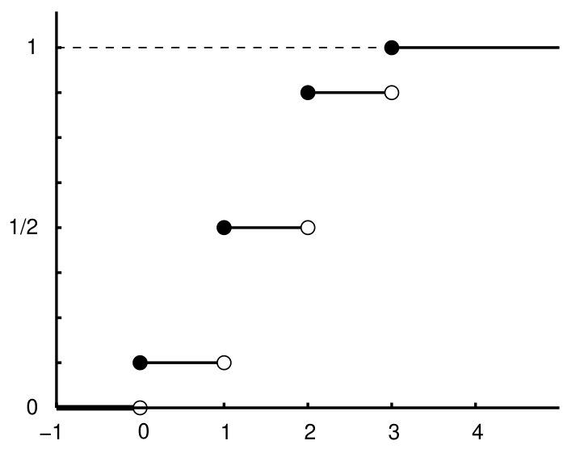

Using the fact that a discrete RV's CDF is a stepwise increasing function whose jump sizes equal the PMF values, we can infer the PMF from a given CDF graph.

From this graph of $F_X(x)$:

we can infer the PMF values based on the jump sizes:

| $P_X(-1)$ | $P_X(0)$ | $P_X(1)$ | $P_X(2)$ | $P_X(3)$ | $P_X(4)$ |
| :-------: | :------: | :------: | :------: | :------: | :------: |
|    $0$    |  $1/8$   |  $3/8$   |  $3/8$   |  $1/8$   |   $0$    |
